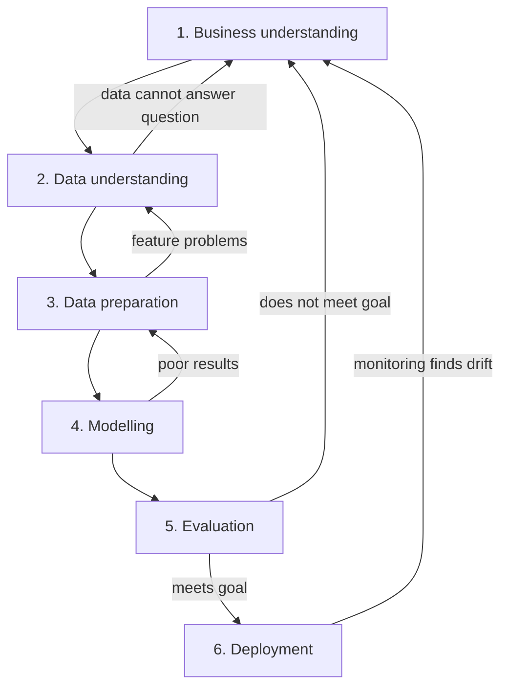

# Concepts — CRISP-DM in plain language

The **Cross-Industry Standard Process for Data Mining** (CRISP-DM) is a checklist for running a
data project. It is not a law of nature and it is not tied to any tool. Its value is that it names
the phases a project passes through, so a team can notice when one has been skipped.

The six phases are:

1. Business understanding
2. Data understanding
3. Data preparation
4. Modelling
5. Evaluation
6. Deployment

The order looks like a straight line, but the arrows really point both ways. The diagram below
shows the usual flow; the text then takes each phase in turn.

## 1. Business understanding

**Plain description.** Work out what decision the project should improve, and turn that into a
measurable question. Decide in advance what "good enough" means.

**Why it exists.** A project aimed at the wrong question wastes every phase after it. This phase
is cheap and prevents the most expensive mistake.

**Example.** "Understand the penguins" is not measurable. "Can species be recovered from four body
measurements, accurately enough to flag likely labelling errors?" is. Success might be "clearly
better than always guessing the most common species, and explainable to a field researcher".

**Common failure.** Starting from the data available rather than the decision required.

## 2. Data understanding

**Plain description.** Look at the data before trusting it: how many rows, which columns, what
types, what is missing, and whether the values are plausible.

**Why it exists.** Modelling on data you have not inspected hides problems until they are
expensive. This phase is where you find that a measurement is recorded in the wrong unit or that
half a column is empty.

**Example.** The penguins table has categorical columns (`species`, `island`, `sex`) and four
numeric measurements. A handful of rows have missing values, and body mass spans a wide range.

**Common failure.** Treating a summary statistic as the truth without checking the raw values.

## 3. Data preparation

**Plain description.** Build the table the model actually needs. Select columns, fix types, handle
missing values, and create derived features.

**Why it exists.** Raw data is rarely in the shape a method expects. Preparation is guided by the
question, not by a generic cleaning checklist.

**Example.** For a species classifier, keep the four measurements as features and `species` as the
target, then drop rows with missing values — and **count** how many were dropped. Silently
discarding rows hides a data-quality problem.

**Common failure.** Doing preparation before deciding what the question requires, which invents
work and can leak information.

## 4. Modelling

**Plain description.** Choose a method, fit it to the training data, and keep the workflow
repeatable.

**Why it exists.** This is where a pattern is learned. But the method should follow from the
question and the audience, not from fashion.

**Example.** A decision tree of depth two can separate the three species and prints as a short
list of `if` rules. A researcher can read those rules, which matters more here than squeezing out
another percentage point of accuracy.

**Common failure.** Reaching for a complex model when a simple one is easier to explain and
nearly as good.

## 5. Evaluation

**Plain description.** Judge the model on data it has not seen, against the goal set in phase one.

**Why it exists.** Training accuracy flatters every model. Evaluation answers "does this actually
meet the business need?" rather than "does it fit the past?".

**Example.** Split the data, measure held-out accuracy, and compare it with a **baseline** that
always predicts the most common species. Look at *where* the mistakes fall using a confusion
matrix; the overlap between two species is more informative than a single number.

**Common failure.** Reporting one number with no baseline and no error analysis.

## 6. Deployment

**Plain description.** Describe how the result will be used, monitored, and maintained.

**Why it exists.** A result that never reaches a decision has no effect. Deployment is also where
drift appears: the world changes and a model that was right last year may be wrong now.

**Example.** A field tool would score new measurements, show a confidence, and route low-confidence
cases to a human. Mistakes that surface later should be logged and fed back into retraining.

**Common failure.** Treating "the model works" as the end of the project.

## How the phases relate

- **Business understanding** sets the target.
- **Data understanding** checks whether the target is reachable.
- **Data preparation** shapes the inputs.
- **Modelling** learns a pattern.
- **Evaluation** checks the pattern against the target.
- **Deployment** puts it to work and keeps it honest.

The value of CRISP-DM is not the six names but the discipline of revisiting them. When evaluation
fails, the honest response is usually to return to an earlier phase, not to tune the model until
the number looks better.
