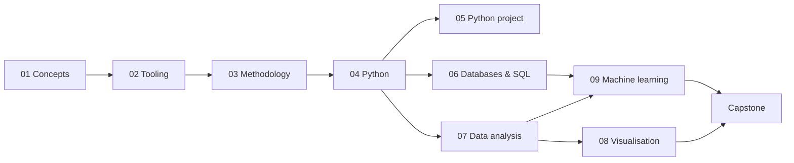
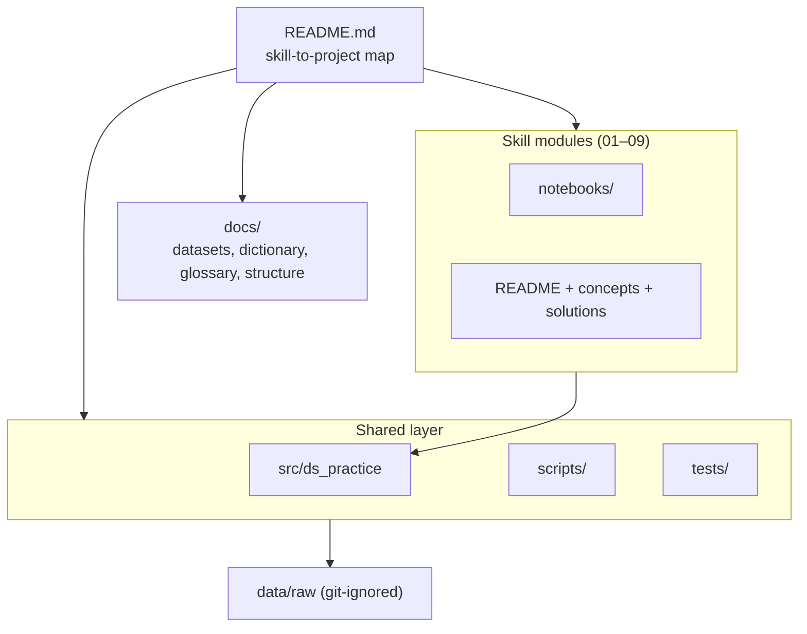

# Data Science Practice

An original, hands-on portfolio of the core data-science skill set — Python, data wrangling, SQL,
analysis, visualisation, and machine learning — built as nine self-contained mini-projects on
public datasets.

> This is an independent reimplementation of a widely taught data-science syllabus, written from
> scratch with new datasets, new code, and original explanations. It is **not affiliated with,
> sponsored by, or endorsed by IBM** or any other organisation; the certificate is credited only as
> the inspiration for the skill set. See [`NOTICE.md`](NOTICE.md).


## Start here

1. Clone the repository and install the environment:

   ```bash
   make install
   ```

2. Fetch the datasets (cached under `data/raw/`, which is git-ignored):

   ```bash
   python scripts/download_data.py --all
   ```

3. Verify everything with the offline test suite:

   ```bash
   make test
   ```

4. Open a module and work through its README, `concepts.md`, then its notebooks:

   ```bash
   jupyter lab 04-python-for-data-science/notebooks/
   ```

If you are new to the material, follow [`docs/learning-path.md`](docs/learning-path.md). If you only
want the map, the table below links every project.

## Skill → project map

| # | Skill area | Project | Dataset | Core techniques |
|---|---|---|---|---|
| 01 | What is data science | [`01-what-is-data-science`](01-what-is-data-science/README.md) | — | Lifecycle, roles, an applied case study |
| 02 | Tools for data science | [`02-tools-for-data-science`](02-tools-for-data-science/README.md) | — | Notebooks, Markdown, Git, reproducibility |
| 03 | Data science methodology | [`03-data-science-methodology`](03-data-science-methodology/README.md) | Palmer Penguins | CRISP-DM end to end |
| 04 | Python for data science | [`04-python-for-data-science`](04-python-for-data-science/README.md) | Palmer Penguins | Types, functions, classes, files, NumPy, pandas, APIs |
| 05 | Python project | [`05-python-project`](05-python-project/README.md) | books.toscrape.com | Web scraping, cleaning, dashboard |
| 06 | Databases and SQL | [`06-databases-and-sql`](06-databases-and-sql/README.md) | OpenFlights | Normalised schema, joins, views, transactions, windows |
| 07 | Data analysis | [`07-data-analysis`](07-data-analysis/README.md) | California Housing | EDA, feature engineering, regression, evaluation |
| 08 | Data visualisation | [`08-data-visualization`](08-data-visualization/README.md) | Gapminder, USGS quakes | Matplotlib/Seaborn, Plotly/Dash, Folium |
| 09 | Machine learning | [`09-machine-learning`](09-machine-learning/README.md) | UCI Adult/Wine/Wholesale | Regression, classification, clustering, pipelines |
| Capstone | Applied capstone | [`falcon9-landing-analysis`](https://github.com/malikb0/falcon9-landing-analysis) | SpaceX launch records | Full workflow (maintained separately) |

Each module ships a `README.md` (objectives, prerequisites, dataset, topics, exercises,
limitations), a plain-language `concepts.md`, worked `solutions.md`, and tutorial notebooks.

## Learning path



## Repository structure



```
data-science-practice/
├── .github/workflows/ci.yml
├── 01-what-is-data-science/
├── 02-tools-for-data-science/
├── 03-data-science-methodology/
├── 04-python-for-data-science/
├── 05-python-project/
├── 06-databases-and-sql/
├── 07-data-analysis/
├── 08-data-visualization/
├── 09-machine-learning/
├── data/raw/                 # downloaded datasets (git-ignored)
├── docs/
├── scripts/
├── src/ds_practice/
├── tests/
├── CITATION.cff  LICENSE  Makefile  NOTICE.md
├── pyproject.toml  requirements.txt
```

## Documentation map

| Document | What it covers |
|---|---|
| [`docs/README.md`](docs/README.md) | Documentation index and conventions |
| [`docs/course-map.md`](docs/course-map.md) | Skill area to original project map |
| [`docs/learning-path.md`](docs/learning-path.md) | Suggested sequence, effort, and outcomes |
| [`docs/datasets.md`](docs/datasets.md) | Source, licence, citation, and fetch command per dataset |
| [`docs/data-dictionary.md`](docs/data-dictionary.md) | Fields, types, units, and provenance |
| [`docs/methodology.md`](docs/methodology.md) | How projects were built and kept reproducible |
| [`docs/glossary.md`](docs/glossary.md) | Key terms defined |
| [`docs/STRUCTURE.md`](docs/STRUCTURE.md) | Directory tree and architecture hierarchy |
| [`docs/FILE_CATALOG.md`](docs/FILE_CATALOG.md) | Every tracked file with type and purpose |
| [`docs/erd-module-06.md`](docs/erd-module-06.md) | Entity-relationship diagram for module 06 |
| [`NOTICE.md`](NOTICE.md) | Inspiration credit, non-affiliation, dataset attributions |

## Quickstart

```bash
make install     # create .venv and install pinned requirements
make data        # download every dataset into data/raw/
make test        # run the offline-safe test suite
make nb          # execute the offline-safe notebooks
jupyter lab      # explore the notebooks interactively
```

`src/ds_practice` provides the shared loaders, metrics, plotting theme, and SQL helpers, so no
notebook copies data-loading or plotting code. Optional libraries (`hdbscan`, `umap-learn`) are
used when present and skipped gracefully when not.

## What this is

- A **teaching portfolio**: every module explains the idea, works an example on real data, and sets
  exercises with worked solutions.
- **Reproducible**: pinned dependencies, fixed random seeds, datasets fetched by one script, and a
  test for every module.
- **Original**: own code and prose on public datasets; attribution and non-affiliation are stated.

## What this is not

- Not a copy of any course material, and not affiliated with the certificate that inspired it.
- Not a production system: models are illustrative and not tuned or monitored for deployment.
- Not a complete curriculum: it covers the core skill set and links to further reading rather than
  every advanced topic.

## Capstone

The applied end-to-end project lives in a separate repository:
[`falcon9-landing-analysis`](https://github.com/malikb0/falcon9-landing-analysis). It combines data
acquisition, SQL, analysis, modelling, and visualisation into one workflow and is not duplicated
here.

## Licence and attribution

Code and prose are released under the [MIT License](LICENSE). Datasets keep their own licences,
recorded in [`docs/datasets.md`](docs/datasets.md) and [`NOTICE.md`](NOTICE.md).
