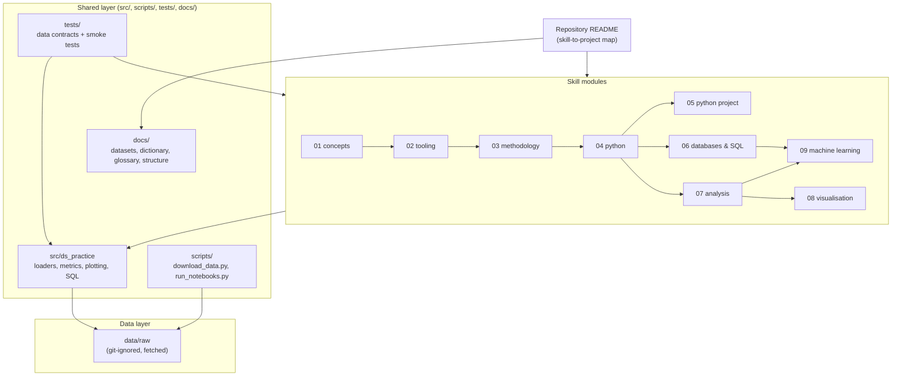

# Repository structure

How the repository is organised. For a file-by-file inventory see
[`FILE_CATALOG.md`](FILE_CATALOG.md); for the learning sequence see
[`learning-path.md`](learning-path.md).

## Directory tree

```
data-science-practice/
├── .github/workflows/ci.yml        # offline-safe test pipeline
├── 01-what-is-data-science/        # concepts, no code
├── 02-tools-for-data-science/      # notebooks, Git, reproducibility
├── 03-data-science-methodology/    # CRISP-DM end to end
├── 04-python-for-data-science/     # language, files, NumPy/pandas, APIs
├── 05-python-project/              # scraping + dashboard
├── 06-databases-and-sql/           # schema, ETL, SQL notebooks
├── 07-data-analysis/               # wrangling, EDA, regression
├── 08-data-visualization/          # static, interactive, maps, app
├── 09-machine-learning/            # supervised + unsupervised + evaluation
├── data/raw/                       # downloaded datasets (git-ignored)
├── docs/                           # cross-cutting documentation
├── scripts/                        # data download and notebook runner
├── src/ds_practice/                # shared importable helpers
├── tests/                          # per-module data contracts and smoke tests
├── CITATION.cff  LICENSE  Makefile  NOTICE.md  pyproject.toml  requirements.txt
```

## Module anatomy

Every skill area follows the same shape, so that moving between modules is predictable:

```
NN-skill-area/
├── README.md          # objectives, prerequisites, dataset, topics, exercises, limitations
├── concepts.md        # plain-language explainer of the key ideas
├── solutions.md       # worked answers to the exercises
├── notebooks/         # tutorial notebooks (objectives → concept → example → exercises)
├── <helper>.py        # module-specific code shared by notebooks and tests
└── app/               # optional dashboard (modules 05 and 08)
```

## Architectural hierarchy



## Dependency direction

- Notebooks and scripts **import** `ds_practice`; the package never imports a notebook.
- `ds_practice` loads files from `data/raw/` and never downloads them itself —
  `scripts/download_data.py` owns acquisition.
- Tests import `ds_practice` and, where useful, the module helpers, but never the notebooks'
  hidden state.
- Documentation links **down** from the hub README to modules and then to `docs/`; no module
  depends on another module's data beyond the shared loader.
