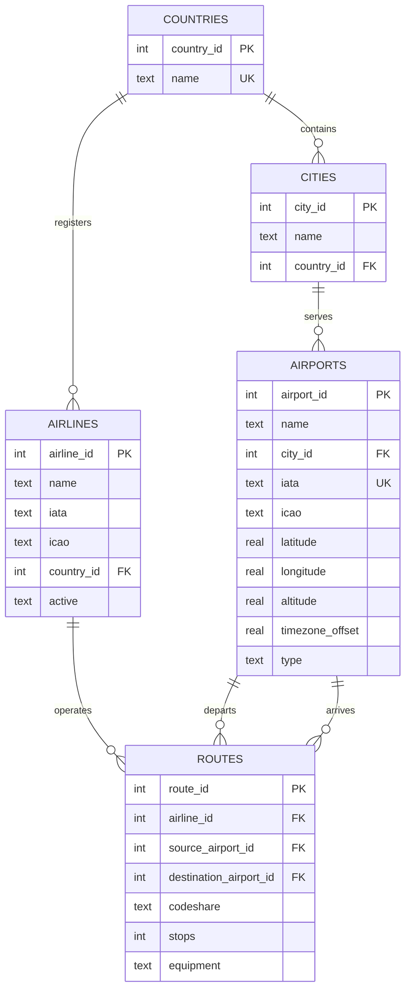

# Module 06 — entity-relationship diagram

The OpenFlights flat files are normalised into five tables. Countries and cities are extracted so
that the same name is stored once, and routes reference airports by id rather than by repeating
airport names.

## Keys and relationships

| Table | Primary key | Foreign keys | Uniqueness |
|---|---|---|---|
| `countries` | `country_id` | — | `name` |
| `cities` | `city_id` | `country_id` → `countries` | `(name, country_id)` |
| `airports` | `airport_id` | `city_id` → `cities` | — (`iata` indexed, nullable) |
| `airlines` | `airline_id` | `country_id` → `countries` | — |
| `routes` | `route_id` (autoincrement) | `airline_id`, `source_airport_id`, `destination_airport_id` | `(airline_id, source, destination)` |

`routes` has two foreign keys into `airports` — one for the origin and one for the destination —
so the relationship is many-to-many between airports, mediated by the route row and its airline.

## Constraints and indexes

- `airports.latitude` and `airports.longitude` carry `CHECK` bounds so an impossible coordinate
  cannot be stored.
- `airlines.active` is restricted to `'Y'`, `'N'`, or `NULL`.
- `routes.stops` defaults to `0` and must be non-negative.
- Indexes exist on `airports (iata)`, `airports (city_id)`, `cities (country_id)`,
  `airlines (country_id)`, and the three route foreign keys, because those are the columns used
  by joins and lookups.
- The view `v_route_details` joins routes to airlines and both airports for convenient reading.

Foreign keys are declared in the schema but SQLite only enforces them when a connection issues
`PRAGMA foreign_keys = ON`, which the notebooks do explicitly.
